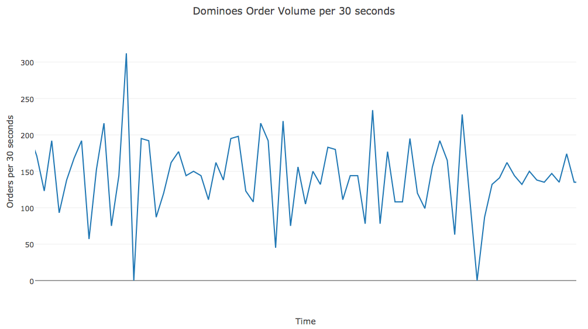

I'm a full time nerd, even when I'm ordering pizza online I can't stop myself from investigating how the websites I'm ordering from work. My latest investigation was Dominoes where I found a neat way to count the number of orders that they process throughout the day. This post is supposed to highlight potential dangers when exposing integer ID's, and how they can allow someone motivated (or sad) enough to track data you might not want to share.

Below is a graph of the data I collected over a 2 weeks of monitoring the Dominos website, it gives a good indication of how Pizza sales fluctuate during this time. The data was collected early 2016 and I contacted Dominoes with details about this potential issue. I received no reply, but they did however fix it as explained below.

<div>
    <a href="https://plot.ly/~tomd324/11/" target="_blank" title="Dominoes Order Volume" style="display: block; text-align: center;"></a>
    <script data-plotly="tomd324:11"  src="https://plot.ly/embed.js" async></script>
</div>

## The issue

After you order a delicious (if a bit expensive) Dominoes pizza you have the option to track your order as it is being cooked and delivered. After opening up Chrome's dev tools I noticed that it was making a request to the following URL:

`http://www.dominos.co.uk/Questionnaire/GetPizzaTrackerStatus?orderId=12345`

This URL returns a JSON response with some information that was used to update the tracker, such as the status (cooking, prepared, out for delivery etc). While I was writing my dissertation I ordered a few too many pizzas over a couple of weeks and I noticed that the `orderId` parameter was just an incrementing number. I also discovered that it wasn't tied to a users session so you could send any arbitrary order ID in the parameter and get the status of that order.

So an idea was born, what if I made a script that uses this to roughly track how many Dominoes were ordered online over time? Once you have a 'start' `orderId` you would just need to increment it by X, and keep requesting that ID until a valid response came back and the `orderId` was 'filled'. You can then log how long that took, and just increment `orderId` by X again and repeat.

```python
import requests, time

start = 1234 # The orderID of a yummy pizza you have literally just brought
current = start

def order_exists(id):
    resp = requests.get("http://www.dominos.co.uk/Questionnaire/GetPizzaTrackerStatus?orderId={0}".format(id))
    if resp.status == 404:
        return False
    return True

while True:
    if order_exists(current):
        current += 10
        print("{0} = {1}".format(time.time(), current))

    time.sleep(1)
```

The actual code is a lot messier and a bit more complex, I found that some dominoes orders are never fulfilled and so you also need to check `current + 1` and `current + 2` to be sure. From the output of the script you can work out the order rate over time and produce the graph above.

## The fix

Dominoes have since fixed this with the release of their new tracker which resembles a creepy HAL-like thing. Now the `orderId` parameter is a base64 string with the following value:

`156710XXX|99a7344b-53ab-4b76-aa31-XXXXX`

As you can see the actual integer order ID is still there but there is a GUID after it. If you attempt to request the status of an order without the correct GUID an error is returned, thus fixing this issue.

This goes to show that **you should be very careful when using public, incrementing integer ID's**. They can easily enable someone (like a competitor) to fairly accurately track the health of your business by how many orders you are processing.

## The results

*Note: I think the first Monday results are skewed due to some problems with my script as the following Monday sales are a huge amount lower*

Dominoes sell a lot of pizzas. These numbers are at least their online orders, I doubt if the in-store or over the phone ones are included. Anyway, at their peak on Tuesday they were processing ~300 orders every 30 seconds. That's 10 a second, and with the ridiculous profit margins Dominoes has on their pizzas (a single pizza can set you back £15-20!) that's a serious amount of money. It seems their busiest days are Tuesday, Friday, Saturday and Sunday, and whilst Monday, Wednesday and Thursday are busy they are a lot lower than the others. Still, 4 out of 7 busy days isn't bad!

What's interesting is lunchtime sales are pretty negligible compared to the evening rush, on most days only processing about an order a second for the whole of the UK. It also seems like some people like getting pizza at 10am!

Whilst running the script I noticed a few times when the Dominoes site went down. Below is a graph that shows this happening twice on Tuesday:



You can see the first crash happens right after ~300 orders in 30 seconds, perhaps this contributed to it? The next is smaller, but each must have resulted in a fairly large amount of missed orders as they did happen at peak times.

## The conclusion

Don't expose incrementing, integer primary keys of anything sensitive, they can be used to extract trends over time. Even if you attempt to protect yourself you might be returning a 404 for an invalid ID and 403 for a valid one, which still tells an attacker which orders are valid and which are not.

I've been struggling with myself over whether to call this a security issue. It's technically leaking information that you might not want public but it's not exactly going to allow an attacker to do anything bad to your site.
    