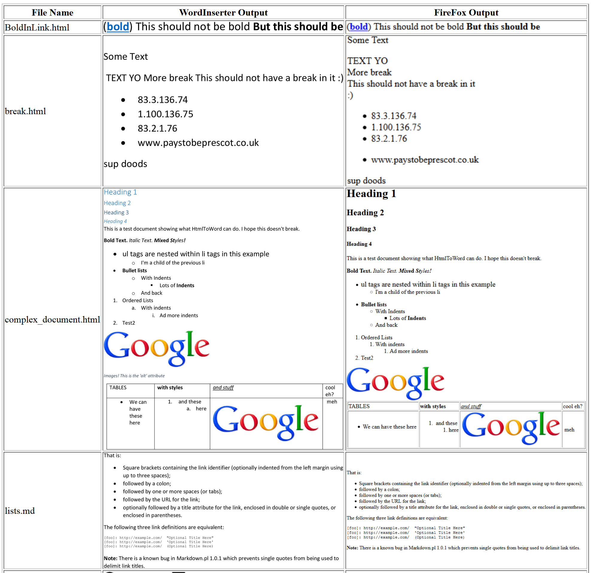

I've released a redesign of my HtmlToWord library, specifically it now supports Markdown and multiple different ways to interact with Word. It's now also been renamed to [WordInserter](https://github.com/orf/wordinserter) to reflect this. 

Originally HtmlToWord was designed to take HTML input, process it and then insert a representation of it into a Word document. I made this for a project at my work involving taking HTML input from a user (created using a WYSIWYG editor) and generating a Word document containing this. I was surprised to find no native way to do this in Word (other than emulating copy+paste, eww), so I made and released HtmlToWord. That library was tied directly to HTML, each supported tag was a [individual class](https://github.com/orf/HtmlToWord/blob/master/HtmlToWord/elements/Table.py) responsible for rendering itself.

This quickly got messy, and in a future version of the project for work Markdown was used instead, so I decided to re-write the library from scratch to handle this. HtmlToWord uses the HTML input to create a number of objects, one for each tag, and then calls a *Render* method on each of them. As WordInserter needs to process both HTML and Markdown I decided to better decouple the parsing from the rendering, otherwise the library would be full of duplicate code. It now takes some supported input and creates a tree of [operations to perform](https://github.com/orf/wordinserter/blob/master/wordinserter/operations.py#L174) which is then recursively fed to [a specific renderer](https://github.com/orf/wordinserter/blob/master/wordinserter/renderers/com.py#L122) responsible for processing it. 

The result of this is the code is a lot cleaner and more maintainable, and it supports different ways to take the input and insert it into Word. Currently only COM is supported, but in the future if [other projects that directly manipulate .docx files](https://github.com/python-openxml/python-docx) mature a bit I can create a renderer that works on Linux.

Using the library is super simple:

```python
from wordinserter import render, parse
from comtypes.client import CreateObject

# This opens Microsoft Word and creates a new document.
word = CreateObject("Word.Application")
word.Visible = True # Don't set this to True in production!
document = word.Documents.Add()
from comtypes.gen import Word as constants

markdown = """
### This is a title


*This is **some** text* in a [paragraph](http://google.com)

  * Boo! I'm a **list**
"""

operations = parse(markdown, parser="markdown")
render(operations, document=document, constants=constants)
```

I have also created an [automated test script](https://github.com/orf/wordinserter/blob/master/Tests/generate_report.py) that renders a bunch of HTML and Markdown documents in both FireFox and Word. This is used to [make a comparison document](https://rawgit.com/orf/wordinserter/master/Tests/report.html) to quickly find any regressions or issues. Judging by the number of installs from PyPi and the number of other contributors to the Github project this library is useful to some people, I hope that they take a look at the redesign.

Here is a snapshot of the top of the comparison page:


    