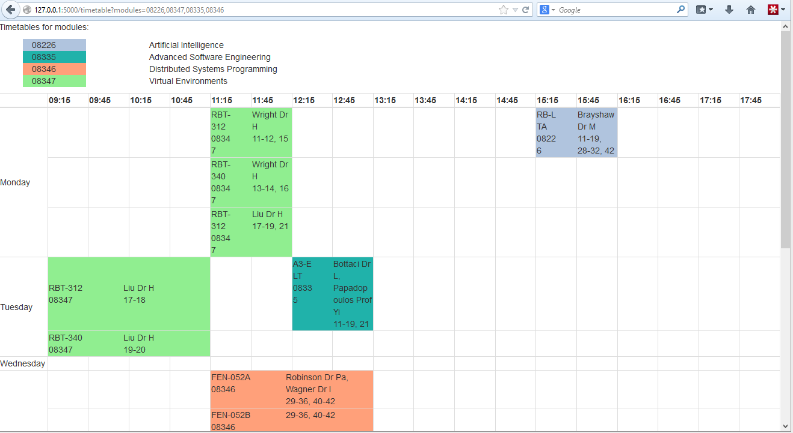
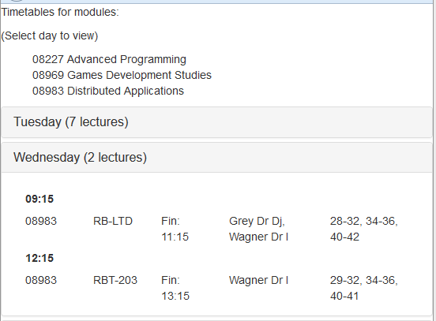

*tl;dr The timetable system sucks, so I [made one that works](#an-alternative)*

Getting your timetable sorted at Uni has never been fun. In years 1 and 2 of my study the department posted a timetable for each year showing all modules and students were expected to remove the classes they did not take, which while not the best system it did seem to work fine. However this year the Uni has a [timetabling website that you can use](http://sws.hull.ac.uk/default.aspx) to create a timetable for the modules that you take, and in theory this is a good idea - students can connect to the website, enter the modules they take and get a personalized up-to-date timetable that they can use.

The implementation of the timetable website is horrendous for the following reasons:

   1. It's so damn slow - every time you select from the list of modules the page refreshes, which takes between 6 and 8 seconds. If you select anything else in that time it is discarded, and the scrollbar position on the select box is also lost when the page finally finishes loading which is very infuriating.
   2. Filtering modules is broken - If you use it your entire selection is lost and you have to start all over again.
   3. No mobile interface - Most students have a smartphone, and it would be reasonable to assume that they might want to view their timetables while they are mobile and not at a computer. Nope.
   4. No hard links - Once you have generated a timetable you can't bookmark it or link to it in the future, you have to go through the whole annoying process of selecting your modules and making a cup of tea while it loads.
   5. One timetable per module - Instead of displaying the modules you selected in a single timetable (which would make sense) you are instead presented with one for each module, which means you have to manually combine all of them into one (which can be error prone).
   6. It uses sessions - if you leave the page open for too long your session times out. Why does it have sessions? Are they really needed to take input from a from and display it in another page? No.
   7. You can't export your timetable - this means you can't import it into other calendar applications, you would have to do it manually.

I thought systems like this were supposed to make things easier? It seems like nobody who designed the timetabling system put any thought into the user interface.

### An alternative
Annoyed by all these issues (and more) I wondered how hard it would be to write an improved version that fixes all of those issues. It turns out not hard at all - you can view it live here: [timetables.tomforb.es](http://timetables.tomforb.es/).

The system I have come up with fixes all of the issues described above:

   1. It's fast: Timetables are created in milliseconds, not seconds.
   2. Filtering modules is awesome: It uses the awesome [Select2](http://ivaynberg.github.io/select2/) library to make filtering modules quick and easy. Module titles are also included in the list.
   3. Mobile: The site is built responsively so it looks good on both desktops and mobiles. If you view a timetable in a mobile interface you get an accordion of days and times, while in a desktop you get a full single timetable containing all of the classes. Try it by re-sizing your browser.
   4. Hard links: You can bookmark your timetable to easily refer to it later.
   5. One big timetable: Lectures are displayed in a single timetable rather than by module.
   6. No sessions: No timeouts.
   7. Data freedom: You can export your timetable in an iCal format which can be imported into most other calendar applications (outlook, thunderbird, google cal etc)

It doesn't contain all the functionality of the existing system, but it seems to be a lot easier to use than the current application. In the future, if people like it I could add functions to hide lectures that have finished, make week numbers relative to the start of freshers week etc.

The point is it's not hard to build a usable interface for any simple system. If an undergrad can hack this together in an hour then the people who designed the Uni's system (presumably for lots of money) have no excuse.

The code can be found [here on github](https://github.com/orf/uni_timetables)

#### Screenshots
Selecting modules is easy, you can browse or filter by typing

Lectures are displayed in a table, each module having its own colours

Works with mobile devices as well

    