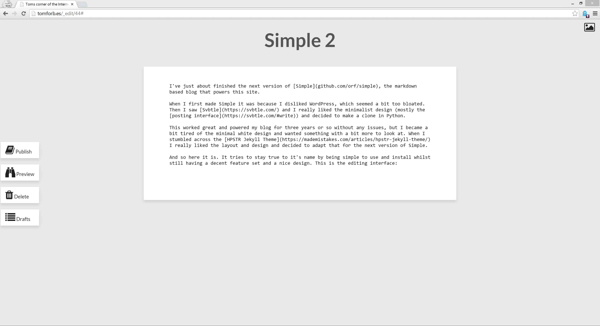

I've just about finished the next version of [Simple](https://github.com/orf/simple), the markdown based blog that powers this site.

When I first made Simple it was because I disliked WordPress, which seemed a bit too bloated. Then I saw [Svbtle](https://svbtle.com/) and I really liked the minimalist design (mostly the [posting interface](https://svbtle.com/#write)) and decided to make a clone in Python.

This worked great and powered my blog for three years or so without any issues, but I became a bit tired of the minimal white design and wanted something with a bit more to look at. When I stumbled across the [HPSTR Jekyll Theme](https://mademistakes.com/articles/hpstr-jekyll-theme/) I really liked the layout and design and decided to adapt that for the next version of Simple.

And so here it is. It tries to stay true to it's name by being simple to use and install whilst still having a decent feature set and a nice design. The editing interface is a styled textarea that grows as you type, and adding an image is a simple as dragging and dropping it onto the page. This will upload the image and insert the right markdown at your cursor position. You can also edit the title by just selecting it and typing.

One thing I really liked about the HPSTR theme is the large image header, and I decided to combine this with the [Bing daily image](http://www.istartedsomething.com/bingimages/). When writing a post you can view the last 25 daily images by clicking the picture icon in the top right and using the left and right arrows to navigate:

I've tried to make installing Simple a painless as possible. You create a virtual environment for Simple, install the package and then use the 'simple' command to create a blog. Creating and maintaining config files is a pain, so you can use the simple command to create nginx and supervisord config files with the right file paths included (You will likely need to run `apt-get install nginx` or `yum install nginx`, and install [supervisor](http://supervisord.org/installing.html) to use them).

    >> mkdir blog && cd blog
    >> python3.4 -m venv env
    >> source env/bin/activate && pip install simpleblogging gunicorn
    >> simple create
    >> nano simple_settings.py
    >> simple nginx_config yoursite.com --proxy_port=9009 > /etc/nginx/conf.d/simple.conf
    >> simple supervisor_config env/ 9009 >> /etc/supervisord.conf
    >> chown -R nobody:nobody ../blog
    >> supervisorctl start simple && service nginx reload

And that's all you need.

    