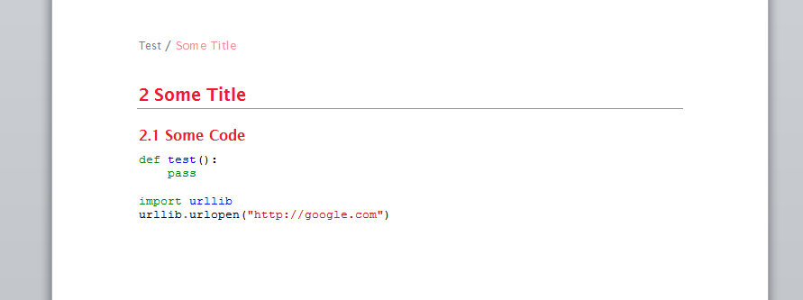

I recently added syntax highlighting and support for CSS stylesheets to [wordinserter](https://github.com/orf/wordinserter), and the implementation was satisfying enough that I thought I would blog about it.

Wordinserter is a library I maintain that lets you insert HTML documents/snippets into Word documents: It's primary use case is when you have a WYSIWYG editor in a users browser that outputs HTML and you want to put that HTML into some kind of word document. I guess you could say it inserts things... into word. Doing this with wordinserter is as simple as:


```python
from wordinserter import parse, insert

html = "<h1>Hello there!</h1>"\
       "<p><strong>I'm strong!</strong></p>"
operations = parse(html, parser="html")
insert(operations, document=document, constants=constants)
```

You can read some more examples and documentation on the Github project here: [https://github.com/orf/wordinserter](https://github.com/orf/wordinserter), and you can see comparison images between how Firefox and wordinserter renders particular HTML snippets here: [https://rawgit.com/orf/wordinserter/master/Tests/report.html](https://rawgit.com/orf/wordinserter/master/Tests/report.html).

Anyway, back to the topic at hand. One of the features our WYSIWYG editor supports is syntax highlighting, and I've always wanted to add proper support for this in wordinserter. In HTML code is usually represented by a `pre` or `code` tag like so:


```html
<pre>
def test():
    pass

import urllib
urllib.urlopen("http://google.com")
</pre>
```

The `pre`/`code` tag has some unusual properties such as respecting all whitespace included within it, but other than that it's just a normal tag. Websites (like this one) use various JS libraries or server-side processing to highlight the contents of these tags to make them more visually appealing which usually boils down to sticking a bunch of `span` tags with CSS classes/inline styles in the right places to highlight the code. For example the snippet below is the highlighted HTML contents of the snippet above:

```html
def <span class="hljs-function"><span class="hljs-title">test</span><span class="hljs-params">()</span></span>:
    pass

import urllib
urllib.<span class="hljs-function"><span class="hljs-title">urlopen</span><span class="hljs-params">(<span class="hljs-string">"http://google.com"</span>)</span></span>
```

### So how does wordinserter highlight code?

You can tell wordinserter to insert highlighted code in two ways. The first, and the simplest, is to simply send a `<pre>` tag with a `language` attribute like so:

```html
<pre language="python">
def test():
    pass

import urllib
urllib.urlopen("http://google.com")
</pre>
```

This uses the awesome `pygments` library under the hood and will highlight the code using that, using **magic**.

This worked for a while, then some clever chap walked up to me and said "Hey, the syntax highlighting works for this code in the WYSIWYG editor but it doesn't display correctly in the document". I looked into it and the problem was a mismatch between using `pygments` to highlight the code in the document and `hljs` to do it on the frontend. So the only natural way forward was to unify them both to use a single style, and so I added support for CSS files to wordinserter.

### You what?

Yeah. That's what I thought to myself when I first had the idea. We have a CSS file that styles stuff on the frontend, and we want the highlighted code to be the same on the generated document. The only way forward that I could see would be to send the CSS file along with the `hljs` highlighted code (the one with all the spans) to wordinserter. It would then see a `span` tag with `hljs-functions`, look at the CSS file and see the appropriate style and then apply it. You can use it like so:

```python
from wordinserter import parse, insert

html = "<h1>Hello there!</h1>"\
       "<p><strong>I'm strong!</strong></p>"
operations = parse(html, parser="html", stylesheets=["h1 { color: red; }"])
insert(operations, document=document, constants=constants)
```


The implementation was actually really simple: [https://github.com/orf/wordinserter/blob/master/wordinserter/parsers/html.py#L55-L73](https://github.com/orf/wordinserter/blob/master/wordinserter/parsers/html.py#L55-L73)

All it does is parse the CSS file using the awesome `cssutils` library then crudely run through each rule, find all elements that match that rule and copy the CSS rules as inline-styles. Not amazing but it gets the job done and required minimal modifications to any other part of the library. I had to make some big changes later when I figured out that the inheritance of these styles was wonky (parent styles overrode the child styles), but that's fixed now so it's all groovy.


In both cases the finished document will look like this:



    